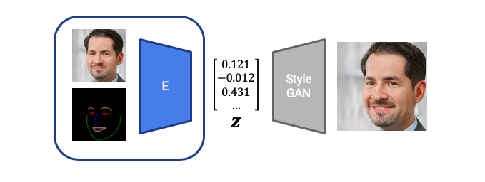
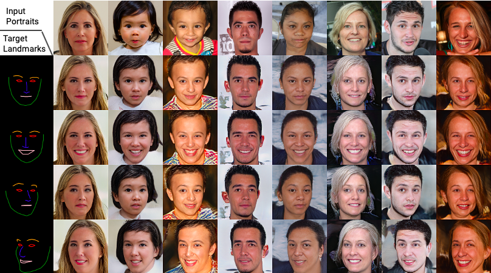

# ADL4CV-Project

This repository contains the source code of our ADL4CV-project about *StyleGAN Latent Space Control with cGANs*.

It builds on the code of *In-Domain GAN Inversion* (https://github.com/genforce/idinvert), which again is a fork of the official *StyleGAN* repository (https://github.com/NVlabs/stylegan). 

In this project, we present a training approach, which allows us to generate StyleGAN latent space embeddings based on easy to control input constraints for the desired shape and appearance of face images. 



Some results are depicted below:



More results can be found in `resources/results`.


## Overview 
Our main changes & extensions can be found in the following files:

##### Training


* `src/training/loss_encoder.py`
	* contains the loss implementation of our encoder which consists of the adversarial loss on the manipulated image `L_adv_manipulated`, the cycle reconstruction loss  `L_cycle_rec` and the adversarial loss on the cycle-reconstructed image `L_adv_cycle`
	* also contains the loss implementation of the discriminator loss (basic GAN-loss)
* `src/training/networks_encoder.py`
	* contains the implementation of the encoder
* `src/training/networks_stylegan.py` 
	* contains the implementation of the discriminator
* `/src/training/training_loop_encoder.py`
	* contains the training loop

	
##### Metrics

* `/src/metrics/appearance_cosine_similarity.py`
	* implementation of CSIM metric
* `src/metrics/frechet_inception_distance.py `
	* implementation of FID distance
* `src/metrics/landmark_hausdorff.py`
	* implementation of Haussdorff metric
* `/src/metrics/qualitative.py`
	* generation of result images

##### Dataset Preparation
* `src/landmark_extractor`
	* creation of our dataset, which includes extracting the keypoints (based on https://github.com/1adrianb/face-alignment) of the FFHQ dataset samples and drawing the corresponding landmark images.

## Prerequisites

Our network expects the following:

* Pre-Trained StyleGAN Network 
* Pre-Trained GAN-Inversion Network
* Dataset: FFHQ dataset + corresponding landmark images

In order to create the dataset, i.e., augment the FFHQ samples with their corresponding landmark images, you can use the jupyter notebook `resources/dataset_creation.ipynb`.


##### Config File
We optimize our notebook to be executed in Google Colab. 

The file `src/config.py` is the main configuration file used for training and inference/metrics. The following values need to be set:

* `DATA_DIR` path to dataset (tfrecords-format, consisting of FFHQ images and their corresponding keypoints and landmark images); may be on Google Drive
* `TEST_DATA_DIR`: path to test-dataset
* `PICKLE_DIR`: path to the pre-trained StyleGAN-Generator-Network
* `INVERSION_PICKLE_DIR`: path to the pre-trained Embedding-Network
* `GDRIVE_PATH`: path, were checkpoints, and results should be saved (can be on Google Drive)


## Run Training-Experiments

In order to organize our experiments and achieve reproducability, we create a dedicated branch to every training-experiment that we run.


To run a new experiment, please create a branch `run/<id>_<description>` and do the setup (e.g. change loss, architecture, etc.) you want to run. The following code will then start the training loop, and save results and model-checkpoints to GoogleDrive:

**[First fill out the `config.py` file as stated above.]**


Clone project & checkout branch

```python
!git clone https://github.com/pascalherrmann/ADL4CV-Project
%cd /content/ADL4CV-Project/src
!git checkout run/<your branch you want to run>
```

Import 1.x version of tensorflow & Connect Google Drive

```python
%tensorflow_version 1.x
import tensorflow as tf
print(tf.__version__)

%load_ext autoreload
%autoreload 2

from google.colab import drive
drive.mount('/content/gdrive') 
```

Run Training

```python
!python train_encoder.py
```

## Ablation Study - Branches

While the `master` branch contains the implementation of our proposed architecture *latent difference based encoder + cycle consistency (in latent space)*, the following branches have been used in our ablation study:

* *Naive Encoder*: `run/p/22_first_try_alternating/`
* *Naive Encoder + Cycle Consistency*: `run/p/24e_3x_adv_whole/`
* *Latent Diff. Encoder + Cycle Consistency (Image Space)*: `run/t/59_rignet_image_space_recon`
* *Latent Diff. Encoder + Cycle Consistency (Latent Space)*: `run/t/61_rignet_keypoints_dense`
* *Latent Diff. Encoder + Cycle Consistency (Latent Space)*: `master`

## Metrics
The instructions for running metrics can be found in the `src/metrics` folder